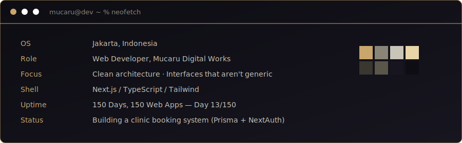

 

 

## stack

 

## `cat challenge.log`

150 days, one shipped web app a day, complexity compounding across seven phases. Not a tutorial series — a forcing function to build production instincts under a daily deadline.

 

## `ls ./featured`

**`mucaru-finance-app/`**
Multi-role finance system for e-commerce — row-level security, atomic transactions via Postgres RPC, full audit trail.
`Next.js` `Supabase` `RLS`

**`vantara-production/`**
B2B production house site shipped to a real client — editorial type system, charcoal/ivory/gold palette.
`Next.js` `Framer Motion`

**`clinic-booking-system/`** — *building now, Day 13*
Role-based auth, relational schema, transactional email — first project with real multi-actor access control.
`NextAuth` `Prisma` `Neon` `Resend`

**`capy-russyon/`**
Full-stack TypeScript app, clean architecture from the first commit.
`TypeScript` `Next.js`

 

## `git log --stat`

 

building in public — one commit at a time

