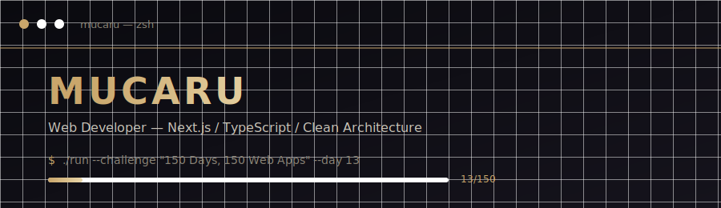
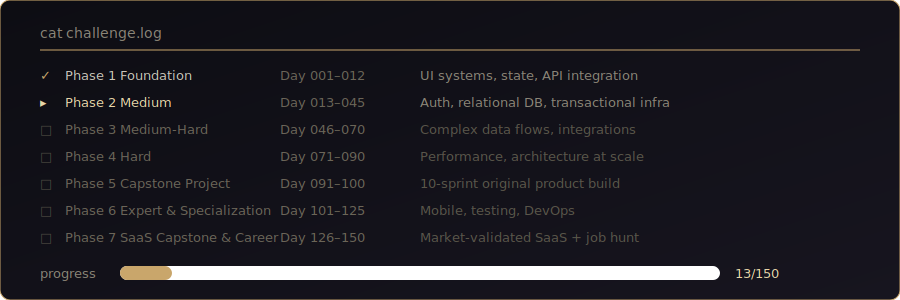

<div align="center">



# Hi, I'm Mucaru 👋

### Full-Stack Engineer • Product Builder • Software Architecture Enthusiast

Building scalable web applications with modern technologies, clean architecture, and production-first mindset.

<br/>


</div>

---

## 🚀 About Me

```yaml
name: Mucaru
role: Full-Stack Developer
focus:
  - Production-ready web applications
  - Clean architecture
  - Database design
  - Security & scalability

currently_building:
  challenge: "150 Days — 150 Web Apps"
  goal: "Transform ideas into shipped products"

philosophy:
  - Build fast
  - Learn deeply
  - Ship consistently
```

---

# 🛠️ Tech Stack

<div align="center">


</div>

<br/>

### Engineering Focus

| Area           | Tools                                    |
| -------------- | ---------------------------------------- |
| Frontend       | Next.js, React, TypeScript, Tailwind CSS |
| Backend        | Node.js, API Design, Server Actions      |
| Database       | PostgreSQL, Prisma, Supabase             |
| Authentication | NextAuth, Role Based Access Control      |
| Deployment     | Vercel, Docker, CI/CD                    |
| Architecture   | Clean Architecture, Modular Design       |

---

# ⚡ `cat challenge.log`

## 150 Days — 150 Web Applications

Not a tutorial series.

A daily engineering challenge designed to build real production instincts:

* Design systems
* Database modeling
* Authentication flows
* Security patterns
* Business logic
* Deployment pipelines
* Real-world constraints

<div align="center">



</div>

---

# 📂 Featured Projects

## 💳 `mucaru-finance-app`

> Multi-role finance platform for e-commerce operations.

**Highlights**

* Row Level Security implementation
* Atomic database transactions
* PostgreSQL RPC functions
* Complete audit logging
* Secure role-based access

**Stack**

`Next.js` `Supabase` `PostgreSQL` `RLS`

---

## 🎬 `vantara-production`

> Premium B2B production house website built for a real client.

**Highlights**

* Custom editorial design system
* High-performance landing experience
* Smooth motion interactions
* Responsive architecture

**Stack**

`Next.js` `Framer Motion` `Tailwind`

---

## 🏥 `clinic-booking-system`

> Enterprise-style healthcare booking platform.

**Highlights**

* Multi-role authentication
* Relational database architecture
* Transactional email workflow
* Real actor permission system

**Stack**

`NextAuth` `Prisma` `Neon` `Resend`

---

## 🦫 `capy-russyon`

> Full-stack TypeScript application built with scalable foundations.

**Highlights**

* Modular code structure
* Strong typing
* Maintainable architecture

**Stack**

`TypeScript` `Next.js`

---

# 🧠 Engineering Principles

```typescript
const mindset = {
  codeQuality: "Readable > Clever",
  architecture: "Simple but scalable",
  database: "Designed before implemented",
  security: "Default secure",
  delivery: "Ship continuously"
};
```

---

# 📊 GitHub Analytics

<div align="center">


</div>

---

# 🗺️ Current Roadmap

```
2026
│
├── Ship production applications
│
├── Improve system design skills
│
├── Master scalable backend patterns
│
├── Build SaaS products
│
└── Contribute to open source
```

---

# 🤝 Let's Connect

<div align="center">

Building software.
Learning constantly.
Shipping every day.

<br/>


</div>

---

<div align="center">

<sub>
Designed & built with curiosity, discipline, and thousands of commits.
</sub>

</div>
